# Preface

The described mods, tools have been used during the Hyperless Havoc HWBOT competition.

# Mods

## tRFC Mod

### Approach

Find the lookup table data where the CMOS values are converted into register values and change an existing value to contain the register limit value.

### tRFC Lookup Table

ASUS uses discrete `tRFC` options, starting at 30 ticks, ending at 160 ticks.

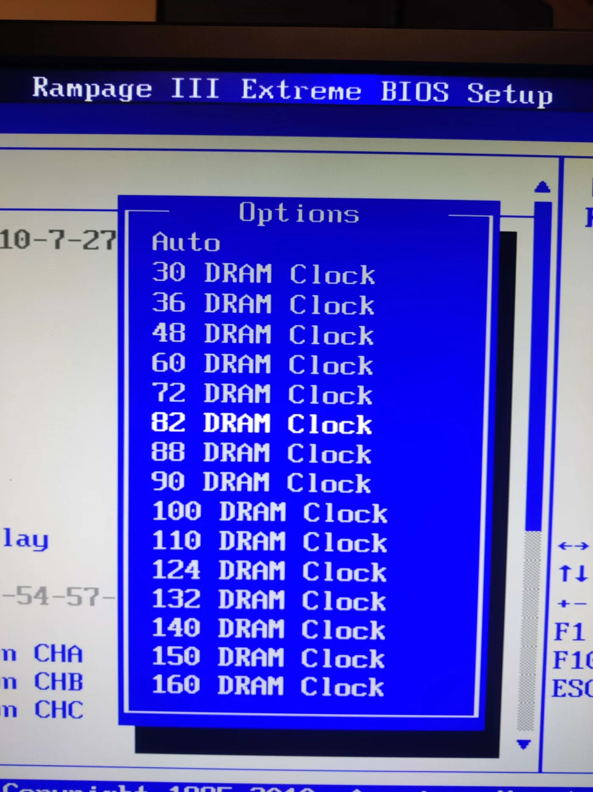

The values stored in CMOS are organized `0 => Auto`, `1 => 30 DRAM Clock` and so forth. Somewhere in the BIOS must be a lookup table (LUT) to translate the CMOS value into a register value. Let's use one of the entries and change its value stored in the LUT. 30 ticks is not relevant for benching, therefore let's use that entry.

To find the LUT in the code, let's check which module could be relevant for that matter.

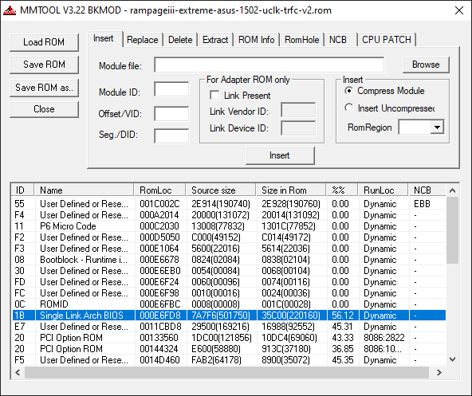

MMTOOL lists a bunch of well-known modules like `P6 Micro Code`, `Bootblock`, etc. From [digitalbath's excellent post in the Socket 462 BIOS Workshop thread](https://community.hwbot.org/topic/208124-socket-462-bios-workshop/page/2/#findComment-596258) we know that the `Single Link Arch BIOS` contains the setup code.

### Module 1B - Single Link Arch BIOS

As a first guess, the `Single Link Arch BIOS` (SLAB) looks promising.

To search for the values, let's write them in hex values:

```
Dec => HEX
30 => 0x1E
36 => 0x24
48 => 0x30
60 => 0x3C
...
```

Let's check if we should search for 8 bit or 16 bit values. Therefore consult the datasheet. Unfortunately Intel decided to hide a lot of relevant stuff in the Core i7 datasheet. Luckily they preserved it in the XEON-5500 series datasheet:

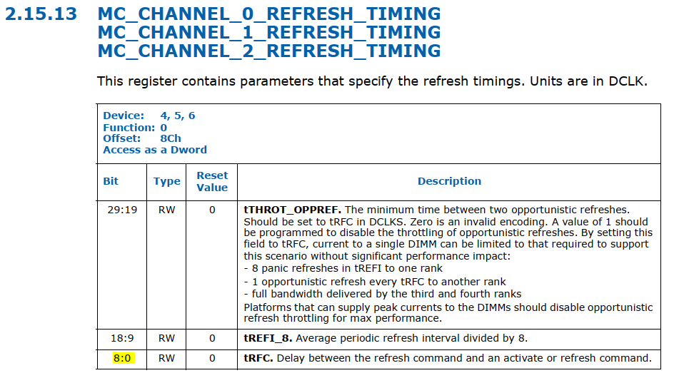

There's 9 bits for `tRFC` in the `MC_CHANNEL_n_REFRESH_TIMING` register, therefore the LUT values could also be stored as 16 bit values.

As we deal with a little endian architecture, the values above will be found in the code as follows:

```
1E 00 24 00 30 00 3C 00...
```

Unfortunately 16 bit values yield no results in the `1B` module. Let's try 8 bits.

Search pattern (in ImHEX) could be like these:

- `1E2430`
- `1E??24??30`
- `1E????24????30`
- you got the pattern...

With this pattern we allow some other data to sit between the values.

Our match is here:

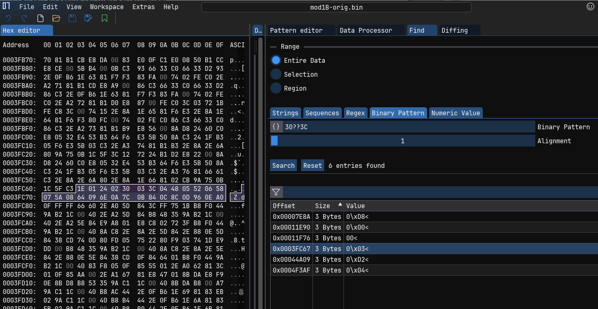

It also shows the assignment of CMOS values to register values: `01` => `1E`, `02` => `24`, ...

After changing those it turns out it is only used for internal calculations in the setup program. The search continues.

Which other modules could be relevant?

- P6 Micro Code? -> nope
- Bootblock? -> Maybe, but it's very small, only 2KB -> There cannot be much logic in here
- ROMID -> Nope
- PCI Option ROMs -> Nope

The list goes on, there is no module in the Rampage III Extreme BIOS that looked to me like it has relevant boot time code for the memory.

### Module 55 - Memory Init Module

I don't know the real name of this module, but it surely contains the memory init code. Disassembling it using IDA reveals that it's a PE32 executable, same as the newer UEFI memory init modules.

Now searching this module yields this:

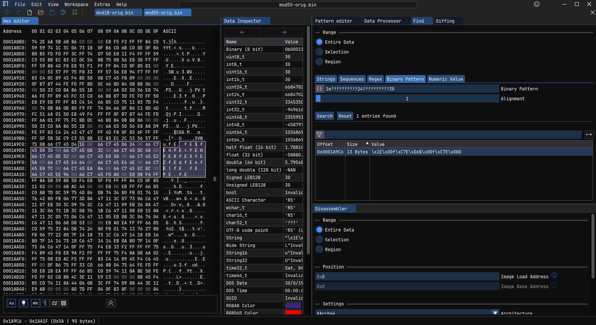

Ok, let's disassemble this:

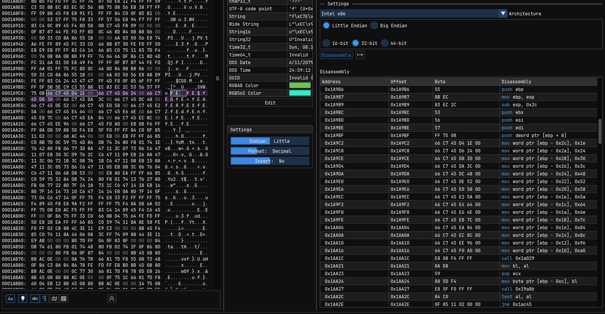

Seems like the code loads the tRFC register values from immediate values into a structure located at base pointer (ebp) + 0x2C. Maybe IDA can give some more insight into this:

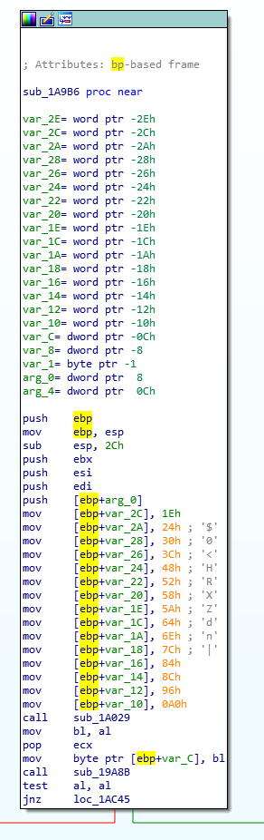

Yep, IDA calls the structure `Var_2C`. Note that it is located directly next to `Var_2E`.

Further down we see that `Var_2E` is referenced for the lookup of the non-auto `tRFC` value:

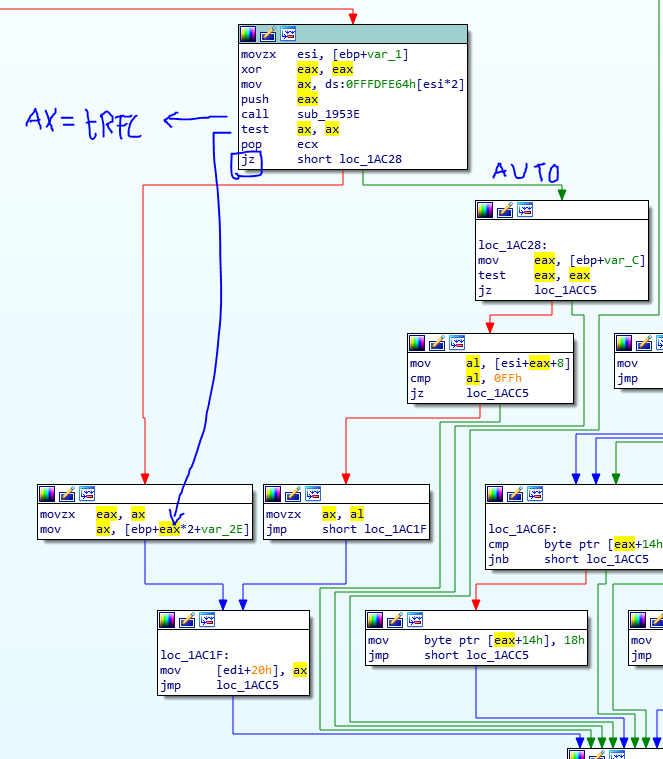

So eventually we can modify the loaded value by replacing `1E 00` with `FF 01`, which changes the value from 30 to 511.

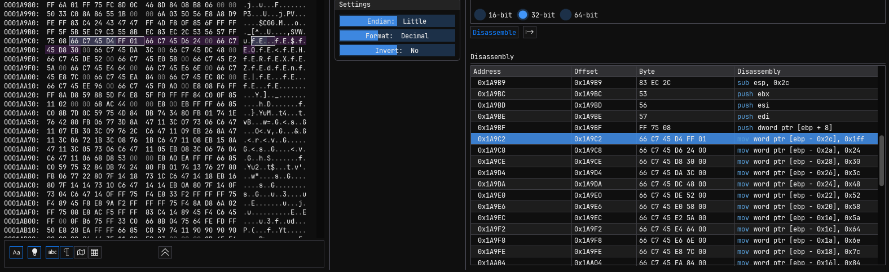

### Timings Check Routine

As a bonus from the tRFC LUT search, we get the auto timings check routine, that is between the tRFC LUT and its effective lookup code:

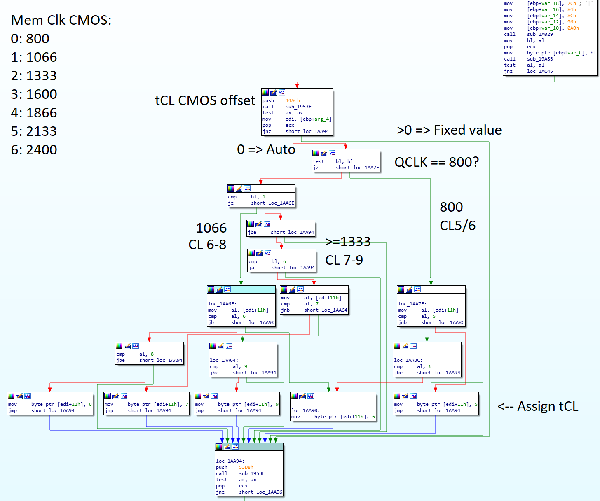

## Config Lock Mod

### Approach

The R3E does not lock the `MC_CFG` whereas the R2E does. Let's find the difference between the BIOS sections regarding that register configuration and check 

First, find the register in the datasheet:

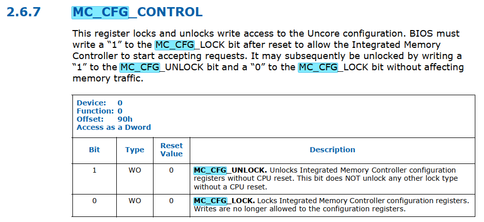

So the `MC_CFG_CONTROL` register is located at Dev 0 Func 0 Offset 90h

There's multiple ways to access these registers. One is via PCI config space and one is via RDMSR/WRMSR commands. WRMSR seems to be more common here, dunno why.

### Finding the MSR Access

To find out the MSR ID, we need to dig into the BIOS code. The **Rampage III Extreme** might have an option to configure the lock somewhere in a hidden setup entry. Let's open AMIBCP and search through the strings for 'memory configuration':

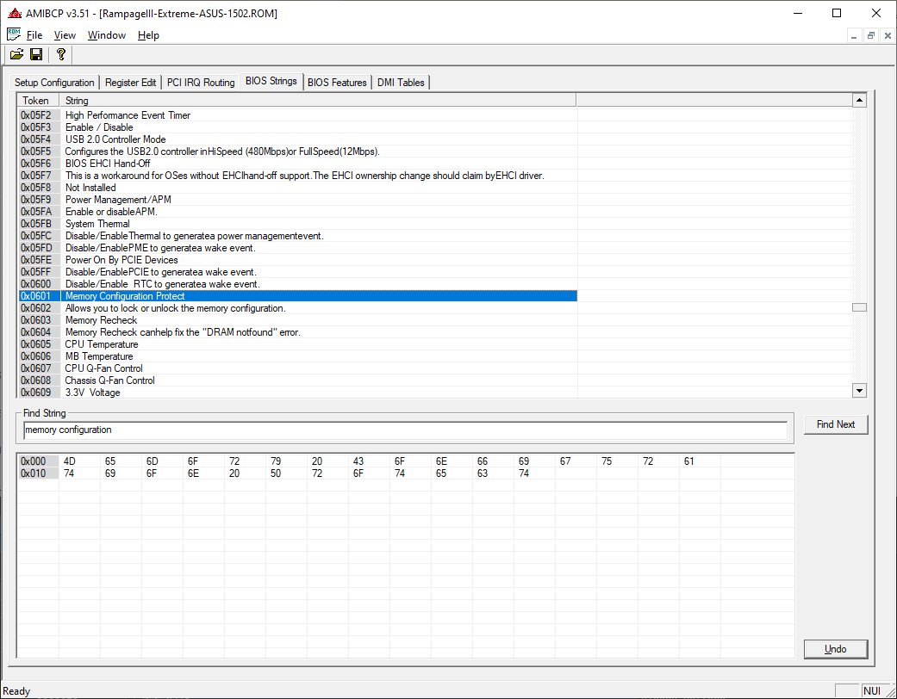

The handle token is `0x0601` --> Find the setup entry that controls this item. With the information from the setup entry, we can find accesses to the CMOS entry. The setup is contained in the 1B module (SLAB).

From the Socket 462 Workshop we know that enumeration setup items have this format:

| Enum Ident | Token | CMOS Index/Mask Word | Cfg | Help | Label[0] | Label[1] |
|-|-|-|-|-|-|-|
| 1B | 2B | 2B | 1B | 1+2B | 2B | 2B |

Assuming this setting is an enumeration, we expect someting like this:

| Enum Ident | Token | CMOS Index/Mask Word | Cfg | Help | Labels |
|-|-|-|-|-|-|
| 01 | 0601 | ???? |...|...|...|

The search pattern is then `01 01 06`:

The search result points to offset 395F2:

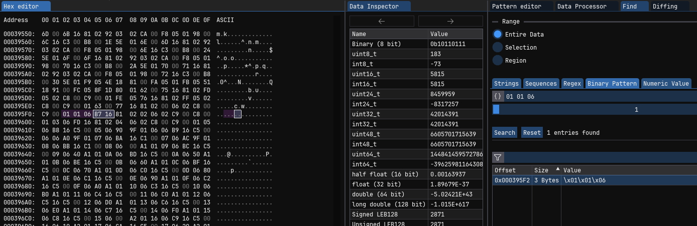

It can be interpreted as follows

- Enum
    - Label: 0x0601 "Memory Configuration Protect"
    - **CMOS Index/Mask: 0x16B7**
    - Config: 0x81
    - Help: 0x02 / 0x0602 "Allows you to lock or unlock the memory configuration."
    - Values:
        - 0 => 0x00C9
        - 1 => 0x00C8

Looking up the values in AMIBCP shows:

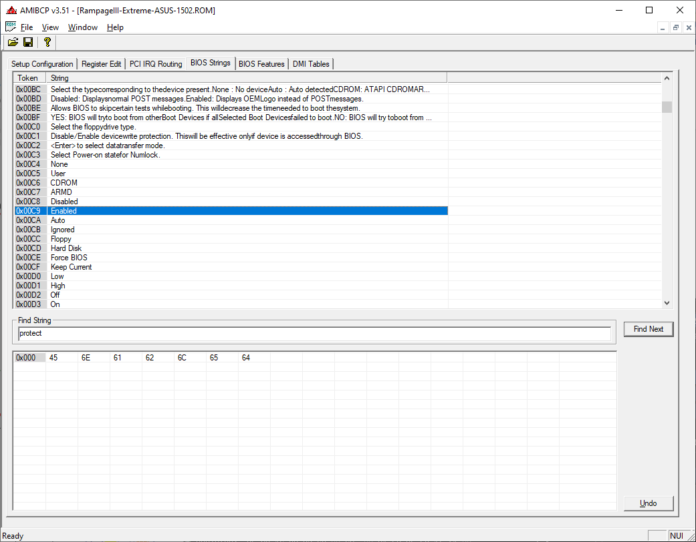

- Value 0 = Enabled => Config locked
- Value 1 = Disabled => Config NOT locked

A search in the code for the CMOS mask `B7 16` returns multiple results. Each must be checked. With a little practice, it becomes easier to discern code sections from data sections by looking at the hex code... In doubt, disassemble each search result.

Et voilà at offset `C2EF` the section containing the register access is revealed:

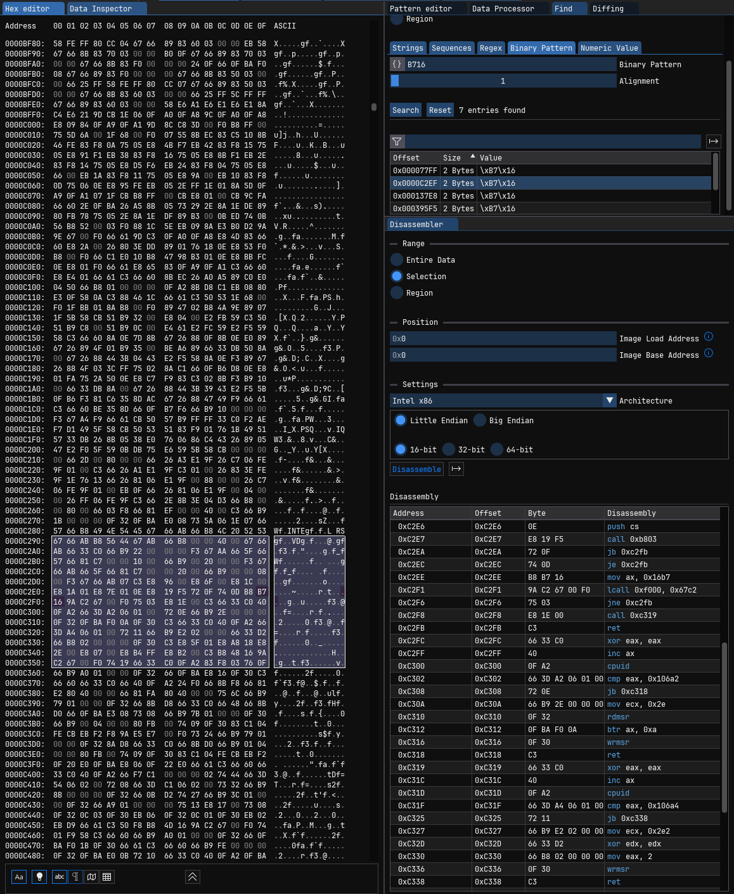

An attempt in pseudo code:

```C
int cfg_locked = read_cmos(0x16b7);

if (cfg_locked == 0)
{
    lock_mc();
}

void lock_mc()
{
    int64_t lock_value = 2;

    int cpu_signature = 0;
    cpuid(1, &cpu_signature, ...);

    // CPUID 0x106a4 = i7 920, 940 965
    // CPUID 0x106a5 = i7 920, 930, 950, 960, 975, Xeon W35xx
    // CPUID 0x206c2 = i7 970, 980, 980X, 990X, Xeon W36xx
    if (cpu_signature >= 0x106a4)
    {
        WRMSR(0x2e2, lock_value);
    }
}
```

> **NOTICE:** A quick search online shows that the MSR `0x2e2` allows access to the `MC_CFG_CONTROL` register via `WRMSR`. Interestingly the information online contradicts my findings: The mod prevents the BIOS from writing a value of 2 to the register and the MC configuration is then not locked in the OS. However [code found in the linux kernel](https://github.com/torvalds/linux/blob/v6.18/drivers/edac/i7core_edac.c#L81) documents that writing the value 2 *unlocks* the MC configuration. I have no clue what's happening here. Maybe this mod only causes the MC configuration lock not to be applied at a later stage.

### Translation to Rampage II Extreme

In the R2E BIOS, let's find the code where the MSR `0x2e2` is written.

We use the `mov ecx, 0x2e2` code for the search: `66 B9 E2 02 00 00`

Disassembling the section reveals, that the call to `lock_mc()` is unconditional:

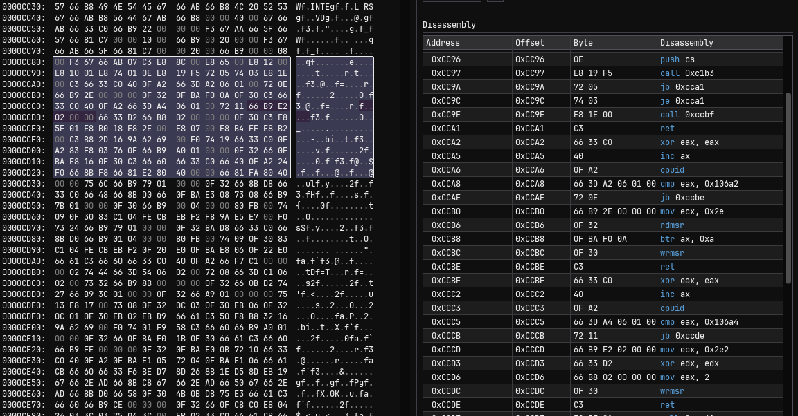

### Modifying the Code

Now to prevent the BIOS from calling `lock_mc()` we tell it to do nothing instead. We need the call to be replaced by a sequence of `NOP` instructions.

The `NOP` is assembled to `0x90`, so let's just fill the three bytes of the `call 0xccbf` with `90 90 90`.

> IMPORTANT: You must not change the binary size (adding or deleting bytes), otherwise it will no more run!

## UCLK Ratio Mod

### Approach

Use AMIBCP / Module 1B to find the CMOS addresses of UCLK and memory clock settings. With the CMOS addresses, find the places in the code where the 3:2 / 2:1 ratio is enforced.

### Finding the CMOS Addresses

For instruction on how to find the CMOS address, see [Config Lock Mod](#config-lock-mod) section.

| Setup Value | Setup Token | CMOS Address |
|-|-|-|
| DRAM Frequency | 0x007D | 0x3553 |
| UCLK Frequency | 0x04DB | 0x53E8 |

### UCLK Adjustment in Module 1B

The setup module adjusts the values of UCLK / Mem clock if the other one is changed. This needs to be adjusted.

From the MC config lock mod we know that in module 1B we can search for `mov ax, 0x3553` => `B8 53 35`. There are a handful results found, all pretty closeby.

Let's disassemble them all and check what happens to the value.

Offsets 0x40778 and 0x40B4D look promising:

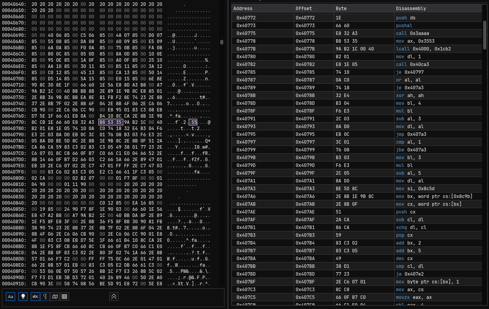

These two sections control the automatic adjustments of the setup values when one or the other is changed.

With the multipliers adjusted from 3/4 to 1, the lowest UCLK value is always valid.

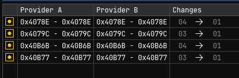

### UCLK Adjustment in Module 55

This is the most difficult part. Module 55 uses both PCI config space and CMOS values to access configuration stuff.

Module 55 is easily disassembled in IDA.

Let's search for the CMOS values
- Immediate: No result
- Byte sequence `B8 53 35`: No result
- Same for `B8 E8 53`

Then PCI config space is the next guess.

In the datasheet we find a few interesting entries by searching for `UCLK` and `QCLK`:

| Register | PCI | Description |
|-|-|-|
| `CURRENT_UCLK_RATIO` | 0:0:C0 | RO register to read UCLK ratio, 7 bits |
| `MC_CHANNEL_n_TX_BG_SETTINGS` | [4,5,6]:0:C0 | Config register for the UCLK/QCLK domain crossing TX |
| `MC_CHANNEL_n_RX_BGF_SETTINGS` | [4,5,6]:0:C8 | Same for RX |
| `MC_DIMM_CLK_RATIO_STATUS` | 3:4:50 | RO register to read DIMM clk ratio and max ratio |
| `MC_DIMM_CLK_RATIO` | 3:4:54 | RW register to set DIMM clk ratio |

To find PCI space access, let's use the immediate find function in IDA. It limits the results because it requires search values to really be immediate values for instructions like `mov` or `push` wich are often used to supply arguments to function calls.

First try `0x54` for the DIMM_CLK_RATIO:

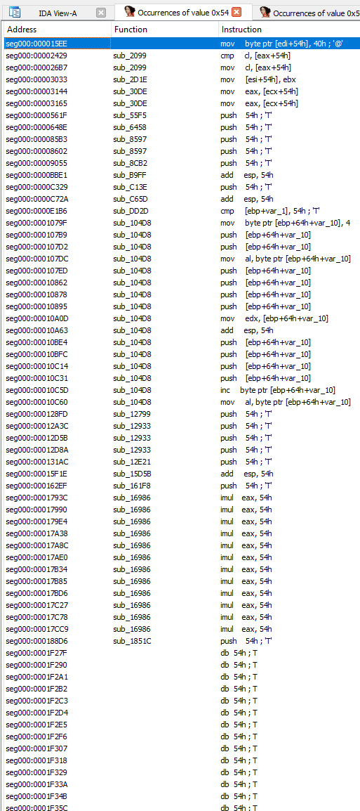

A crapton of results. We only care for results which use the value as an immediate for a push or mov instruction, not as an immediate offset of a pointer dereference or an operand for a math operation or stack pointer adjustment.


First search result:

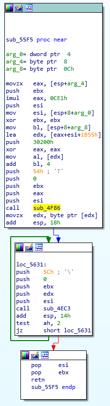

Let's have a closer look at some interesting sections:

```asm
...
mov     bl, [esp+8+arg_8]
...
add     bl, 4          ; Prepare BX to contain an argument
push    54h ; 'T'      ; 1. arg, our search result
push    0              ; 2. arg
push    ebx            ; 3. arg, see above
push    eax            ; 4. arg, likely the value to write
push    esi            ; 5. arg, some context?
call    sub_4F86       ; Function call -> let's examine that function
```

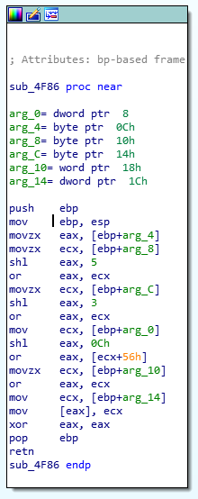

The Intel doc about accessing PCIe config registers states this:

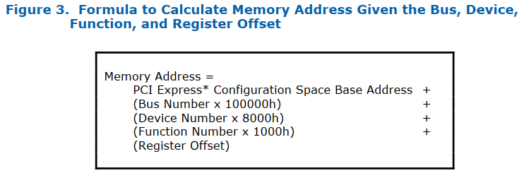

We have:
- Bus:  Bit 20
- Dev:  Bit 15
- Func: Bit 12

That's what we see in the code:

```asm
shl eax, 5  ; Bus = 12 + 3 + 5 = 20
...
shl eax, 3  ; Dev = 12 + 3 = 15
..
shl eax, C  ; Func = 12
```

From the very bottom, we see that it's a write function:

```asm
mov [eax], ecx  ; value is stored in ECX
```

Now everywhere `sub_4F86` is called, we know that it's a PCI config space write access.

If we break down the caller above, we see that it supplies the following args:

- 54h : Offset
- 00h : Func
- ebx : arg_8 + 4h => Dev

This is a write operation to the `MC_CHANNEL_n_DIMM_INIT_CMD` register, where `n` is supplied as `arg_8` into the function. This function is likely used to train the memory.

To find our section of interest, let's cycle through the search results and find the section where e.g. `C0` offset is read.

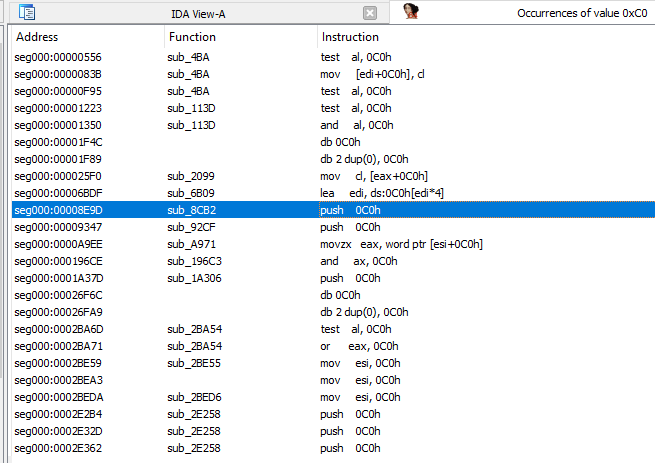

First search result is in `sub_8CB2`. It is a very long routine. We'll look at some interesting points:

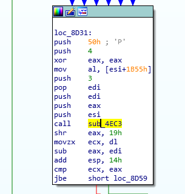

This section reads 32 bit from PCI reg 3:4:50 (`MC_DIMM_CLK_RATIO_STATUS`) and shifts the content right by 25 bits, therefore extracting the `MAX_RATIO` field from the register. So far nothing interesting.

Next section is here:


```asm
xor     eax, eax                     ; eax = 0
mov     al, [esi+1B55h]              ; al = active memory channel [0..2]
; Grab the UCLK ratio
push    0C0h                         ; Offset = 0C
push    edi                          ; Func = 0 (EDI is 0, see above)
push    edi                          ; Dev = 0
push    eax                          ; Arg = memory channel
push    esi
call    sub_4E6A                     ; 8 bit read from `CURRENT_UCLK_RATIO`, result in AL
mov     [esi+1B5Eh], al              ; store UCLK_RATIO into struct at 0x1B5E
movzx   eax, al                      ; make UCLK_RATIO a 32 bit value
mov     ecx, eax                     ; copy UCLK_RATIO into ECX
cdq                                  ; make UCLK_RATIO a 64 bit value in EDX:EAX
imul    ecx, 85h                     ; ECX = UCLK_RATIO * 133 = UCLK_VALUE
push    3
pop     ebx                          ; EBX = 3
idiv    ebx                          ; EAX = UCLK_RATIO / 3
; Initiate another PCI op
push    50h ; 'P'                    ; Offset = 50
push    4                            ; Func = 4
push    3                            ; Dev = 3
; Gotta calculate some value inbetween
add     ecx, eax                     ; Genius: Adjust the eff. clock bc. the 1/3 fraction was omitted in 133
mov     eax, 0F4240h                 ; EAX = 1'000'000
cdq                                  ; make EAX 64 Bit
idiv    ecx                          ; EAX = 1'000'000 / UCLK_VALUE
mov     [esi+1B6Ah], eax             ; store in 1B6A
movzx   eax, byte ptr [esi+0E94h]    ; EAX = QCLK_RATIO
imul    eax, 7                       ; EAX = QCLK_RATIO * 7
mov     bl, [eax+esi+3DDh]           ; BL = some lookup with QCLK_RATIO
xor     eax, eax                     ; EAX = 0
mov     al, [esi+1B55h]              ; AL = active memory channel
mov     byte ptr [ebp+var_5], bl     ; var_5 = looked-up value
; PCI read continues...
push    eax                          ; Arg = memory channel
push    esi
call    sub_4EC3                     ; 32 bit read from `MC_DIMM_CLK_RATIO_STATUS`
movzx   edx, bl                      ; EDX = looked-up value
mov     [ebp+var_10], eax            ; var_10 = MC_DIMM_CLK_RATIO_STATUS register
and     eax, 1Fh                     ; Mask bits 4:0 -> QCLK_RATIO
add     esp, 28h
cmp     edx, eax                     ; compare looked-up value to QCLK_RATIO
jz      short loc_8F16               ; if equal, jump, otherwise:
push    [ebp+var_5]                  ; arg1 = looked-up value
push    esi                          ; arg2 = some context?
call    sub_3681                     ; update QCLK_RATIO in 0x0E94
pop     ecx
pop     ecx
```

After this section we have both UCLK and QCLK in the memory. UCLK is located in 0x1B5E, QCLK is in 0x0E94.

Going on, the code check if it it a 45nm or a 32nm cpu at `loc_8F16`. It does so by comparing the device id (DID) of Device 0, Func 0, Offset 0 (Intel QuickPath Architecture Generic Non-core Registers) with the value `0x2C70` which is the value found in 32nm processors.

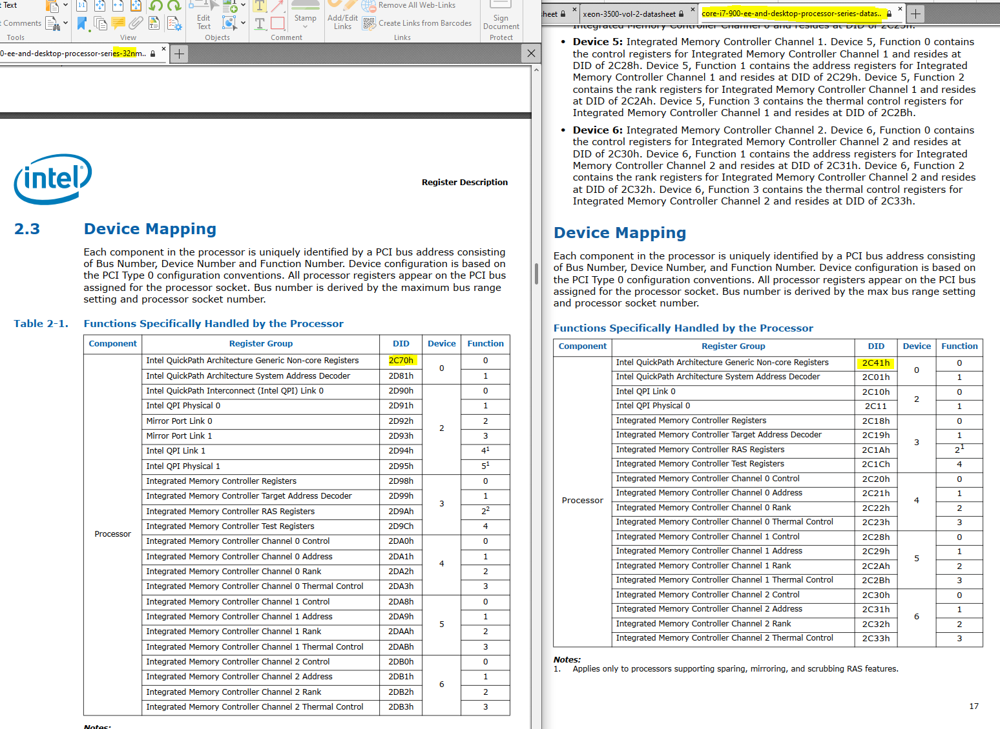

Next let's check the 45nm part (left side), which is the easier to understand:

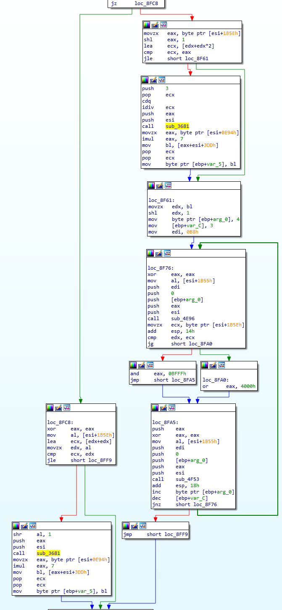

```asm
xor     eax, eax                    ; EAX = 0
mov     al, [esi+1B5Eh]             ; AL = UCLK_RATIO
lea     ecx, [edx+edx]              ; ECX = EDX * 2 = looked-up value * 2, likely QCLK_RATIO * 2
movzx   edx, al                     ; EDX = UCLK_RATIO
cmp     ecx, edx                    ; Compare QCLK_RATIO * 2 with UCLK_RATIO
jle     short loc_8FF9              ; if (2*QCLK <= UCLK) jump off
shr     al, 1                       ; AL = QCLK / 2
push    eax                         ; arg1 = QCLK / 2
push    esi                          
call    sub_3681                    ; store QCLK / 2 in 0x0E94h
movzx   eax, byte ptr [esi+0E94h]   ; retrieve 0x0E94h value
imul    eax, 7                      ; deja vu, get the adjusted QCLK value
mov     bl, [eax+esi+3DDh]          ; ...
pop     ecx
pop     ecx
mov     byte ptr [ebp+var_5], bl
```

Ok, we have definitely found the place where the unwanted stuff happens.

The mod is simple, make sure to always skip the adjustment:

```asm
; Compare 
cmp     eax, eax                    ; Triggers ZF set -> jle will always jump
jle     short loc_8FF9              ; if (ZF set) jump off`
```

Use the online assembler or any assembler of choice to assemble `cmp eax, eax` => `39 C0`.

In the hex editor, change `3B CA` to `39 C0`, that's it.

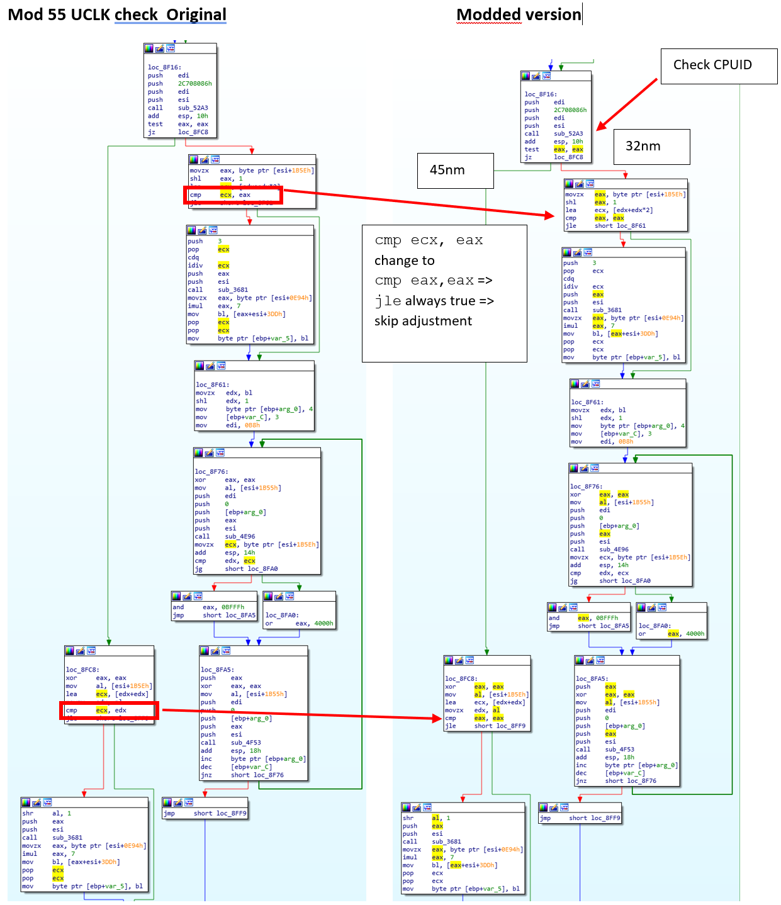

For 32nm I won't do the ASM math here again, but clearly this section does the same thing but somewhat more stuff involved (which I did not bother to analyze).

Some interesting struct offsets:

- `[esi + 0x1B5E]` = UCLK ratio
- `[esi + 0x1B55]` = Active Memory Channel
- `[esi + 0x0E94]` = QCLK ratio
- `[esi + 0x03DD]` = Mem Multiplier LUT

### Flashing the Modded BIOS

Use MMTOOL to replace the modules in the .rom file.

Then flash the file using a CH341 programmer or equivalent.

Users reported that it cannot be flashed with AFU. The setup will accept lower UCLK values but it will not apply at boot. My take is that with AFU, the module 55 is not flashed and therefore the DRAM clock ratio is adjusted during memory init.

# Addresses and Offsets

During BIOS analysis, I noted some addresses and offsets of values inside the modules and structures. These are usually referenced as shown in the below assembly snippet (IDA).

The CMOS values are only valid for the R3E bios 1502. Probably the offsets in the `edi` structures are valid for many ASUS BIOSes.

## Module 1B Sections

| Address | What |
|-|-|
| 4032B | Memory Clock Values Table |
| 40692 | UCLK Values Table |

## Module 55 Sections

Some subroutines of interest in the module 55:

| Address | What |
|-|-|
| sub_4E6A | PCI config space read function **8 bit** |
| sub_4E96 | PCI config space read function **16 bit** |
| sub_4EC3 | PCI config space read function **32 bit** |
| sub_4F22 | PCI config space write function **8 bit** |
| sub_4F53 | PCI config space write function **16 bit** |
| sub_4F86 | PCI config space write function **32 bit** |
| sub_52A3 | Compare PCI Device ID |
| sub_5B9F | Write memory timings to HW registers |
| sub_8CB2 | UCLK check and much more stuff |
| sub_92CF | Write the definitive UCLK into the HW registers |
| sub_12E21 | Write to DRAM MRS registers -> send commands to DRAM sticks |
| sub_18C5B | Main memory training routine |
| sub_18E7C | Display POST code XX |
| sub_19D11 | DRAM clock speed LUT |
| sub_1A029 | Read DRAM multi and convert to CMOS value |
| sub_1A306 | ? |
| sub_1A9B6 | Sanity check for tCL, evaluation of tRAS, tRFC |


## CMOS Indices

Some important CMOS value indices/masks within the Rampage III Extreme BIOS. These apply global because they are read from CMOS memory directly.

The values read from here have values in the format as they are stored in the CMOS registers. There are discrete values like BCLK or enumerations like all timings whereas 0 => Auto, 1 => first non-auto value. Usually values that have a certain range and a step size, like a CPU multiplier are enumerations.

| Address | Value | Intermediate Value |
|-|-|-|
| A700 | BCLK | ? |
| 3553 | DRAM Clock | 3405 |
| 53E8 | UCLK | 53D0 |
| 44F0 | AI Overclock Tuner | ? |
| 3548 | XMP on/off | ? |
| 44AC | tCL | ? |
| 44B0 | ? | ? |
| 53D8 | tRAS | ? |
| 25E8 | ? | ? |
| 7348 | ? | ? |
| 8318 | ? | ? |

In module 55 these are accessed as 32 bit values.

```asm
; Module 55 code
; Read tCL from CMOS
push 44ACh        ; Store offet on stack
call sub_1953E    ; Call CMOS read routine
; Result in AX
```

Search for these values using the IDA immediate value search (alt + i)

In module 1B, these are accessed as 16 bit values, more like this:

```asm
; Read tCL from CMOS
mov ax, 0x44AC         ; Argument in AX
lcall 0x4000 0x1cc1    ; Call CMOS read routine
; Result in BX
```

## Module 55 Timing Values

This seems to be a structure where the timing values are stored for later write into the registers. Originally these are calculated using an auto routine or copied from the CMOS values.

| Offset | Value |
|-|-|
| 11h | tCL |
| 12h | tRCD |
| 13h | tRP |
| 14h | tRAS |
| 15h | tRRD ? |
| 16h | tWTR |
| 17h | tRTP |
| 18h | tFAW ? |
| 20h | tRFC |

```asm
; Read tCL from some huge RAM struct (module 55)
mov edi, [ebp+arg_4]   ; struct was passed as a function argument
mov al, [edi+11h]      ; dereference struct offset
```

Access for these values can be searched for in IDA using the immediate value search (alt + i).

The memory timing sequence looks as follows in IDA:


The values are loaded into register from the struct, e.g. `[edi+20h]`. Then shifted to the proper location and masked with a limit value using `sub_56CA`, then written into the according PCI config register using `sub_4F86`.

## PCI Config Space

These are straight from the processor datasheet.

- Device 0: Uncore
- Device 2: QPI
- Device 3: IMC
- Device 4: Memory Channel 0
- Device 5: Memory Channel 1
- Device 6: Memory Channel 2

### Some Registers

| Address [PCI] | Register | Description |
|-|-|-|
| 0:0:C0  | `CURRENT_UCLK_RATIO` | RO register to read UCLK ratio, 7 bits |
| [4,5,6]:0:80  | `MC_CHANNEL_n_RANK_TIMING_A` | 3rds (back-to-back w-r, r-w, r-r) |
| [4,5,6]:0:84  | `MC_CHANNEL_n_RANK_TIMING_B` | 3rds (back-to-back w-w), tRRD, tFAW |
| [4,5,6]:0:88  | `MC_CHANNEL_n_BANK_TIMING` | tWR, tRTP, tRCD, tRAS, tRP |
| [4,5,6]:0:8C  | `MC_CHANNEL_n_REFRESH_TIMING` | tRFC, tREFI |
| [4,5,6]:0:90  | `MC_CHANNEL_n_CKE_TIMING` | tCKE, tXP, etc.|
| [4,5,6]:0:C0  | `MC_CHANNEL_n_TX_BG_SETTINGS` | Config register for the UCLK/QCLK domain crossing TX |
| [4,5,6]:0:C8  | `MC_CHANNEL_n_RX_BGF_SETTINGS` | Same for RX |
| 3:4:50  | `MC_DIMM_CLK_RATIO_STATUS` | RO register to read DIMM clk ratio and max ratio |
| 3:4:54  | `MC_DIMM_CLK_RATIO` | RW register to set DIMM clk ratio |

## AMI SLAB

The AMI Single Link Arch BIOS can be split into its individual sections. For my analysis this was not necessary because from the execution perspective, this is handled as one binary with static linking, therefore no split needed.

Unfortunately I found no reasonable way to disassemble it as a whole to display all cross-references like with a PE32 image in IDA. This makes tracing calling locations difficult, for only the forward path can be evaluated with the code directly.

The SLAB's content has been searched through by other users already, therefore I will not dig into this more.

Other than the AMIBIOS8_1B_Utils there is a tool in the coreboot repository `ami_slab`. I compiled it for win32 and used it to extract the data from the SLAB. It basically works but some windows components adds LF characters after 0D in a good intention but therefore ruins the whole binary. Maybe if it is used on linux, it would work properly.

# Tools

- IDA Freeware (I used 7.0.191002)
- ImHEX: https://github.com/WerWolv/ImHex
- Online assembler: https://defuse.ca/online-x86-assembler.htm
- AMIBIOS8 1B utils: https://github.com/pinczakko/AMIBIOS8_1B_Utils
- ami_slab (coreboot): https://github.com/coreboot/bios_extract/blob/master/src/ami_slab.c
- AMIBCP 3.5.1
- MMTOOL V3.22 BKMOD
- ChatGPT (top for explaining assembly sequences)

# References

- [CPUID - Thomas Krenn Wiki](https://www.thomas-krenn.com/en/wiki/CPUID)
- [X86 Instruction Reference](https://www.felixcloutier.com/x86/)
- [Online X86 Assembler](https://defuse.ca/online-x86-assembler.htm)
